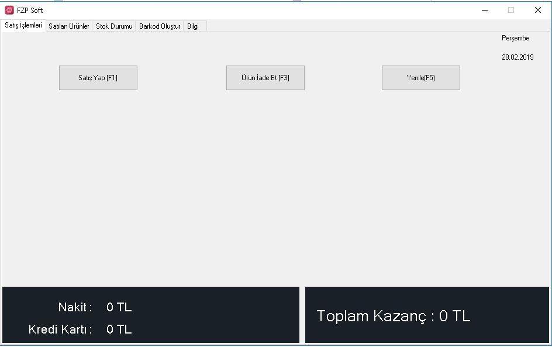
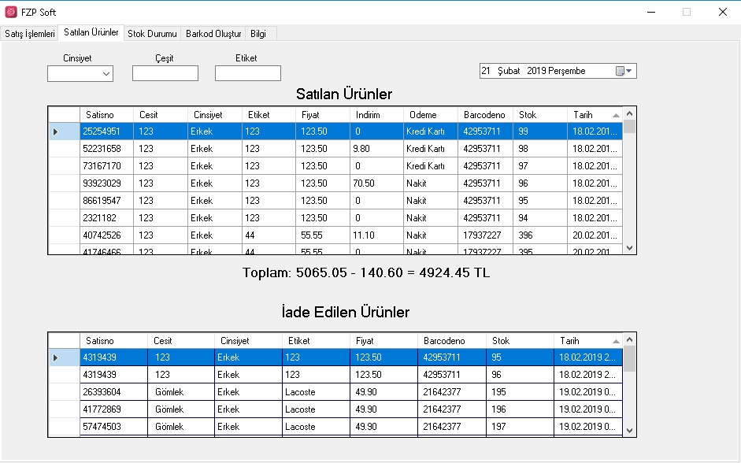
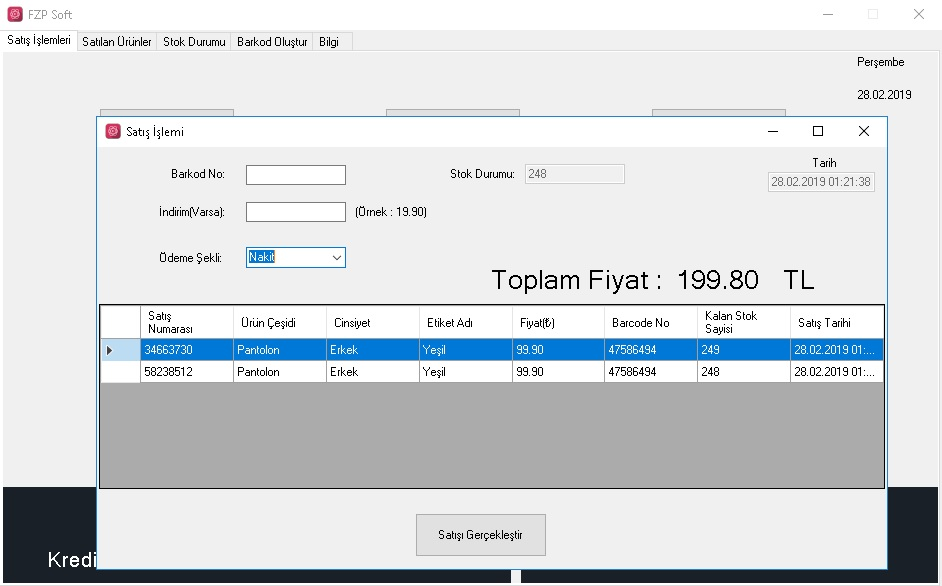
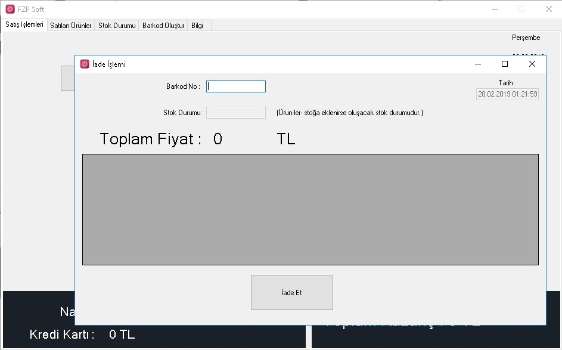
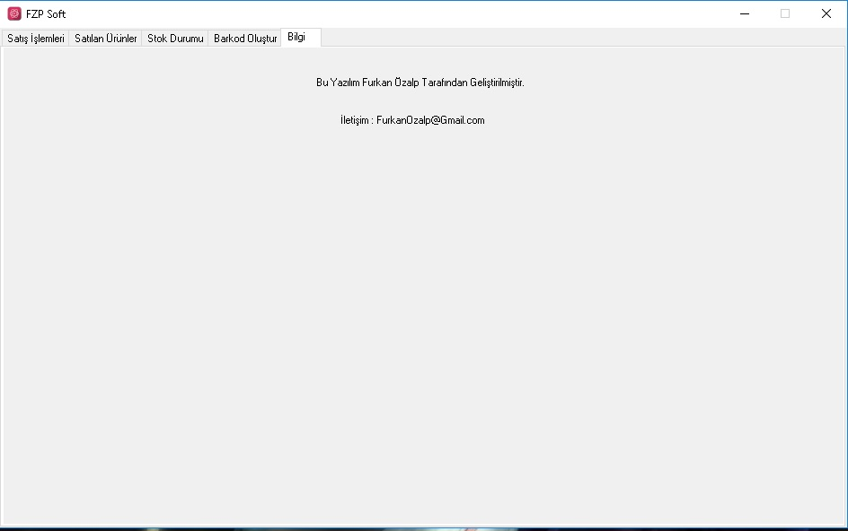

# Barcode System, Market Automation(Sales) Program

## ABOUT
- Language: C#, Sqlserver: mySQL.
- Control of inventory, sales statistics and current account control for Stores and Markets.
- Generate barcodes for products(variety, price,stock etc.). After that, there are options to print out and save it to stock. Some features: Search products in current stock, sales statistics by day, Sales and Refund list of products etc. Sales and Refund processes are work with Barcode Scanner Device.
- In addition, there is daily current account control in the program interface (Credit Card, Cash and Total Profit)
- The program runs without error and the software is open to improvements.

**Note: Only Turkish language is available.**
## INSTALLATION

*This program require C# and for database(sqlserver) you must install mySQL.

### FEATURES

